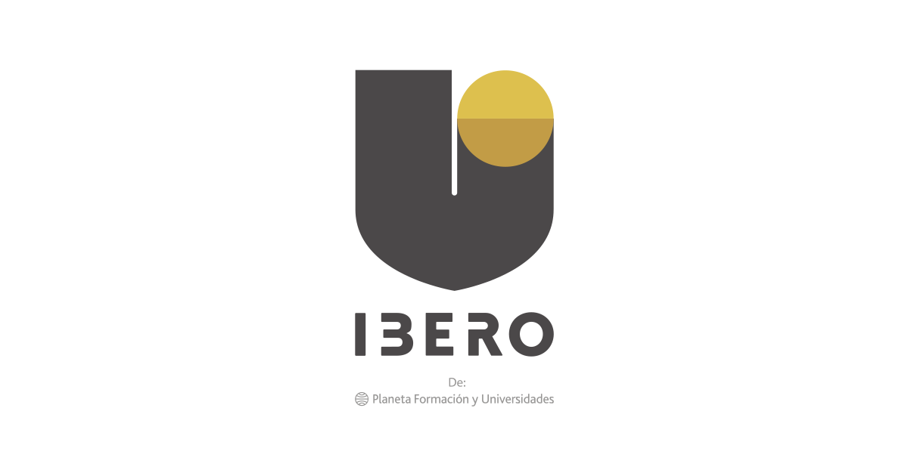
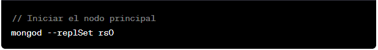
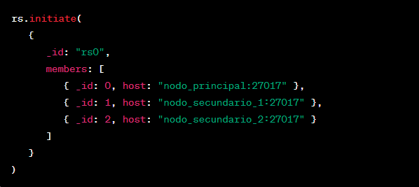
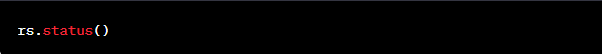

**Actividad 2 - Conceptos y comandos básicos de la replicación en bases
de datos NoSQL**

> Presentado por
>
> Esteban Junco Cepeda
>
> Luis Esteban Segura
>
> Brayan virguez
>
> Corporación universitaria Iberoamericana
>
> Facultad de ingeniería

Bases de datos avanzadas

2023

**Requerimientos No Funcionales**

**11. Introducción**

Este documento establece los requisitos no funcionales para el Sistema
de Gestión de Eliminatorias de Sudamérica. Se centra en la redundancia y
la disponibilidad del sistema para garantizar un rendimiento óptimo y
continuo durante las operaciones del torneo.

**2. Requerimientos No Funcionales**

**2.1 Redundancia**

**2.1.1 Descripción**

El sistema debe ser diseñado y configurado con redundancia para
garantizar la continuidad del servicio en caso de fallas o eventos
inesperados.

**2.1.2 Criterios de Calidad**

**Alta Disponibilidad:** El sistema debe mantener una disponibilidad del
99.9% o superior, incluso en situaciones de fallos de hardware o
software.

**Replicación de Datos:** Se implementará la replicación de datos en al
menos dos ubicaciones geográficas diferentes para garantizar la
recuperación en caso de desastres naturales o eventos catastróficos.

**Balanceo de Carga:** Se aplicará un mecanismo de balanceo de carga
para distribuir eficientemente las solicitudes entre los servidores,
evitando la sobrecarga y mejorando la capacidad de respuesta.

**Monitorización Continua:** Se establecerá un sistema de monitorización
constante para identificar y abordar proactivamente cualquier punto
único de fallo o degradación del rendimiento.

**2.2 Disponibilidad 24x7**

**2.2.1 Descripción**

El sistema debe estar disponible las 24 horas del día, los 7 días de la
semana, para asegurar el acceso continuo a los datos y funcionalidades
del torneo.

**2.2.2 Criterios de Calidad**

Mantenimiento Programado: Las ventanas de mantenimiento planificado
deben ser mínimas y preferiblemente durante horas con menor actividad.
Se notificará a los usuarios con anticipación sobre cualquier
mantenimiento programado.

Respaldo Automático: Se realizan respaldos automáticos de la base de
datos con una frecuencia mínima de una vez al día. Los respaldos se
almacenarán en ubicaciones seguras y se probará su restauración
periódicamente.

Detección y Recuperación Automática: El sistema debe contar con
mecanismos de detección automática de fallas y recuperación automática
para minimizar el tiempo de inactividad en caso de problemas no
planificados.

**Estrategia de Replicación**

**Topología del Conjunto de Replicación:**

**Nodos:**

**Nodo Principal (Primary)**: Responsable de recibir todas las
operaciones de escritura y lecturas.\
**Dos Nodos Secundarios (Secondary):** Replican los datos del nodo
principal y pueden ser utilizados para lecturas.

**Configuración de Redundancia:\
**Los nodos secundarios se ubicarán en diferentes ubicaciones
geográficas para garantizar la redundancia en caso de fallas o eventos
catastróficos.

**Configuración y Comandos**

1.  Configuración Inicial en el Nodo Principal:

2.  Inicialización del Conjunto de Replicación:

> Conéctate al nodo principal utilizando el shell de MongoDB:
>
> 
>
> Ejecuta el siguiente comando para iniciar el conjunto de replicación:
>
> 
>
> Esto crea un conjunto de replicación llamado \"rs0\" con tres nodos.
>
> 3\. Verificación del Estado del Conjunto de Replicación:
>
> {
>
> Este comando mostrará el estado del conjunto de replicación. Asegúrate
> de que todos los nodos estén en estado \"PRIMARY\" o \"SECONDARY\"
> según corresponda.
>
> Los resultados obtenidos al ejecutar estos comandos son la creación
> exitosa de un conjunto de replicación con tres nodos en MongoDB. Aquí
> hay una descripción de los resultados::
>
> **Configuración Inicial en el Nodo Principal:**
>
> Inicia el servidor MongoDB en el nodo principal. Se visualizan
> mensajes indicando que el servidor está escuchando en el puerto
> predeterminado (27017).
>
> **Inicialización del Conjunto de Replicación:**
>
> Este comando inicializa el conjunto de replicación con el nombre
> \"rs0\" y especifica los tres miembros del conjunto con sus
> respectivas direcciones y puertos. Retorna un objeto de configuración
> del conjunto de replicación.
>
> **Verificación del Estado del Conjunto de Replicación:**
>
> El comando rs.status() debería mostrar el estado del conjunto de
> replicación. Cada nodo debe estar listado con su estado (PRIMARY o
> SECONDARY). El estado debería mostrar que el conjunto de replicación
> está saludable.
>
> Para verificar el estado de replicación, puedes usar el comando
> rs.status() en el shell de MongoDB conectándose a cualquiera de los
> nodos. Este comando proporcionará información detallada sobre el
> estado de replicación, incluyendo la salud de cada miembro y el estado
> de los datos replicados.
>
> **Casos de Pruebas para Verificación del Mecanismo de Replicación**
>
> Proyecto: Sistema de Gestión para Eliminatorias de Sudamérica
>
> **1. Introducción**
>
> Este documento establece los casos de prueba para verificar la
> correcta implementación del mecanismo de replicación en el Sistema de
> Gestión para Eliminatorias de Suramérica. Los casos de prueba se
> centran en garantizar la redundancia y disponibilidad 24x7 del
> sistema.
>
> **2. Casos de Prueba**
>
> **2.1 Verificación de la Configuración Inicial**
>
> **Caso de Prueba 1**: Inicio Exitoso del Nodo Principal
>
> **Objetivo**: Verificar que el nodo principal se inicie correctamente.
>
> **Pasos:**
>
> Iniciar el servidor MongoDB en el nodo principal.
>
> **Resultado Esperado:**
>
> El servidor se inicia sin errores y está escuchando en el puerto
> 27017.
>
> **2.2 Verificación de la Inicialización del Conjunto de Replicación**
>
> **Caso de Prueba 2:** Inicialización del Conjunto de Replicación
>
> **Objetivo:** Verificar que la inicialización del conjunto de
> replicación se realiza correctamente.
>
> **Pasos:**
>
> Conectarse al nodo principal usando el shell de MongoDB.
>
> Ejecutar el comando rs.initiate({\...}) para iniciar el conjunto de
> replicación.
>
> **Resultado Esperado:**
>
> Se recibe un objeto de configuración del conjunto de replicación sin
> errores.
>
> **2.3 Verificación del Estado del Conjunto de Replicación**
>
> **Caso de Prueba 3:** Estado del Conjunto de Replicación
>
> **Objetivo:** Verificar que el estado del conjunto de replicación se
> muestra correctamente.
>
> **Pasos:**
>
> Conectarse a cualquier nodo usando el shell de MongoDB.
>
> Ejecutar el comando rs.status() para obtener el estado del conjunto de
> replicación.
>
> **Resultado Esperado:**
>
> Se muestra el estado del conjunto de replicación, indicando que todos
> los nodos están en estado \"PRIMARY\" o \"SECONDARY\", y no hay
> errores significativos.
>
> **2.4 Verificación de la Redundancia y Disponibilidad**
>
> **Caso de Prueba 4:** Redundancia y Disponibilidad
>
> Objetivo: Verificar que la redundancia y la disponibilidad se
> mantienen en situaciones simuladas de fallos y recuperación.
>
> **Pasos:**
>
> Simular un fallo en el nodo principal y verificar la promoción de un
> nodo secundario a \"PRIMARY\".
>
> Restaurar el nodo principal y verificar la conexión y sincronización
> automática.
>
> Realizar operaciones de escritura y lectura durante estas
> simulaciones.
>
> **Resultado Esperado:**
>
> Se observa la promoción de un nodo secundario en caso de fallo y la
> restauración exitosa del nodo principal.
>
> Las operaciones de escritura y lectura son exitosas en todo momento.
